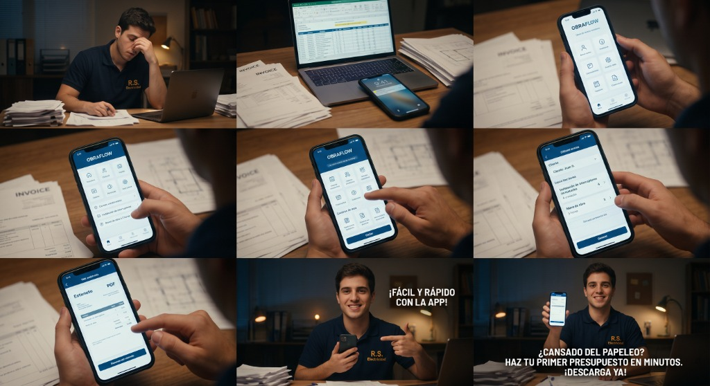

# Guion y Storyboard — Anuncio para Electricistas y Gremios

## 🎬 Prompt / Sinopsis de Producción

> **Personaje y Escenario:**  
> Un joven electricista (con un polo azul marino que dice 'R.S. Electricidad' y herramientas visibles en su cinturón), sentado en un escritorio de madera desordenado por la noche, rodeado de facturas de papel y un portátil abierto que muestra una hoja de cálculo compleja.

---

### 📷 Referencia Visual del Storyboard

---

## ⏱️ Estructura y Escaleta Escena por Escena

### Escena 1: El Dolor (Acción Inicial)
- **Plano:** Plano medio cinematográfico, iluminación tenue de noche con lámpara de escritorio cálida.
- **Acción:** El electricista muestra una clara expresión de frustración, fatiga y agobio. Suspira pesadamente mientras se frota los ojos y la cara con las manos, abrumado por facturas en papel y el Excel en el portátil.
- **Detonante:** La pantalla de un smartphone moderno sobre la mesa se ilumina con una notificación. Él lo coge con curiosidad.

### Escena 2: Transición
- **Cámara:** Movimiento de acercamiento suave (*smooth zoom-in*) con enfoque nítido directamente hacia la pantalla del teléfono móvil.

### Escena 3: Demostración Rápida de la App (Interacción)
- **Plano:** Primer plano macro (*close-up*) detallado de la pantalla del smartphone.
- **Acción en pantalla:** Interfaz moderna, limpia e intuitiva:
  1. Selecciona el cliente: **Pedro García**.
  2. Añade partida: **Instalación de interruptores** (4 unidades).
  3. Añade partida: **Mano de obra**.
  4. Pulsa el botón principal: Genera el presupuesto profesional en PDF desglosado con un solo toque.

### Escena 4: La Solución (Resolución Emocional)
- **Plano:** Plano medio.
- **Acción:** El rostro del electricista cambia radicalmente de la frustración a una sonrisa de alivio y tranquilidad. Mira la pantalla del presupuesto terminado y luego alza la mirada a cámara con satisfacción y complicidad.

### Escena 5: Cierre & Llamada a la Acción (CTA Final)
- **Plano:** Plano medio con el electricista sosteniendo el smartphone con orgullo.
- **Fondo:** El taller / despacho permanece visible con desenfoque cinematográfico (*bokeh* suave).
- **Texto en pantalla (Superpuesto en español):**
  > **¿CANSADO DEL PAPELEO?**  
  > **HAZ PRESUPUESTOS EN MINUTOS CON LA APP.**  
  > **DESCARGA AHORA.**
- **Especificaciones técnicas de producción:** Vídeo en alta definición (1080p / 4K), 30 fps, ratio 9:16 (vertical para Reels/TikTok) y 16:9 (horizontal).
